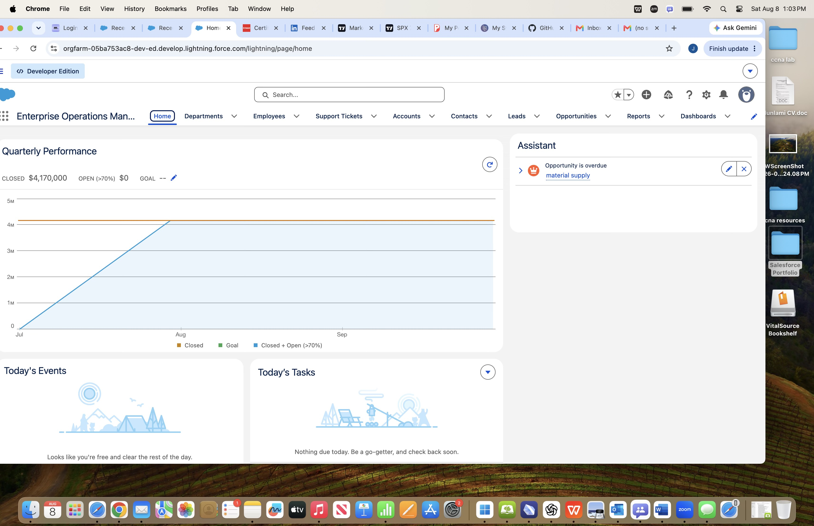
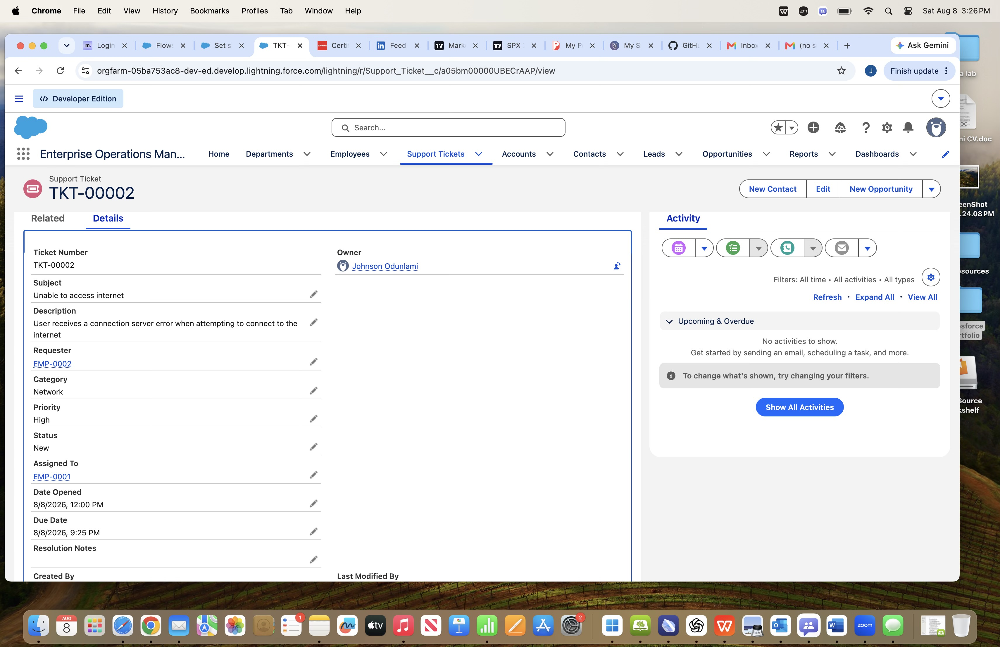
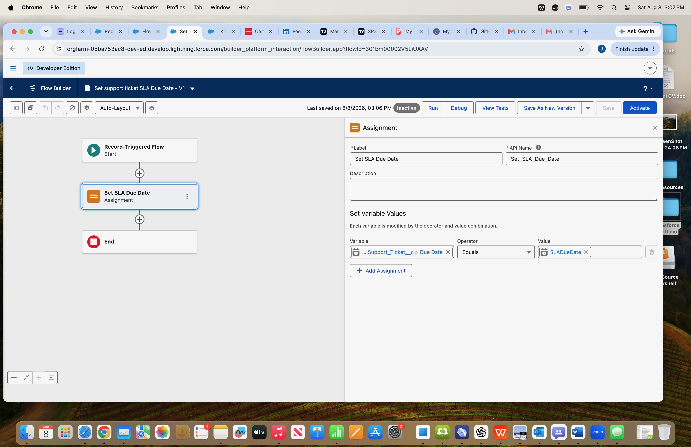
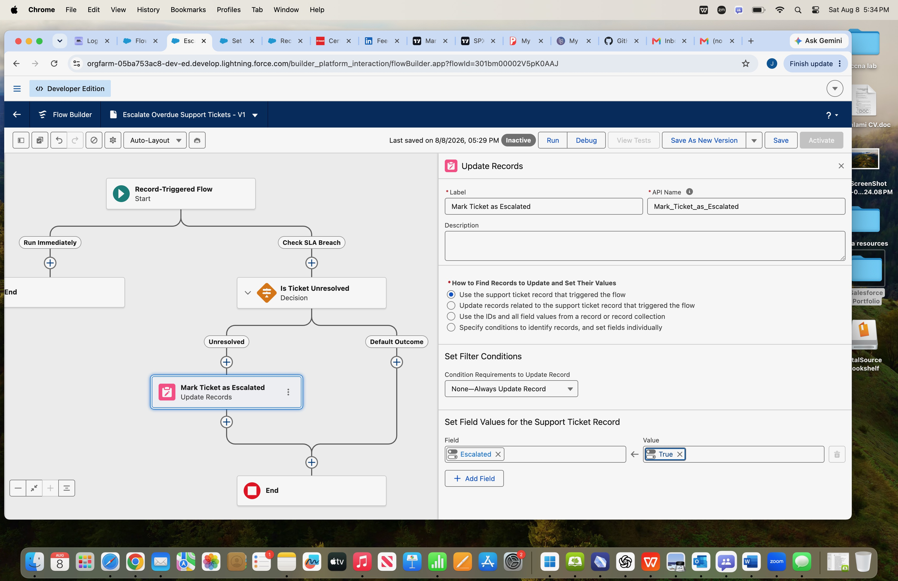

# IT Help Desk — Salesforce Portfolio Module

## Overview

The IT Help Desk module was built in Salesforce Lightning as part of the Enterprise Operations Management System. It provides a centralized process for submitting, assigning, tracking, escalating, and reporting on internal IT support requests.

## Business Requirements

The solution needed to:

- Allow employees to submit support tickets.
- Track ticket category, priority, status, requester, technician, and resolution.
- Automatically calculate SLA due dates.
- Prevent tickets from being resolved or closed without resolution notes.
- Automatically escalate unresolved tickets when their SLA due date is reached.
- Provide operational reporting and management dashboards.

## Salesforce Objects

### Department
Stores organizational department information.

### Employee
Stores employee records and links employees to departments.

### Support Ticket
Stores IT support requests and includes:

- Ticket Number
- Subject
- Description
- Requester
- Category
- Priority
- Status
- Assigned To
- Date Opened
- Due Date
- Resolution Notes
- Escalated

## Automation

### SLA Due Date Flow

A record-triggered Flow automatically calculates the ticket Due Date based on priority:

- Critical — 4 hours
- High — 8 hours
- Medium — 24 hours
- Low — 48 hours

### SLA Escalation Flow

A scheduled Flow evaluates tickets when their Due Date is reached.

If the ticket is still unresolved:

- Escalated is automatically set to True.

## Validation Rule

A validation rule prevents users from setting a Support Ticket to Resolved or Closed unless Resolution Notes are provided.

## Reports

Created reports include:

- Open Support Tickets by Priority
- Escalated Support Tickets
- Support Tickets by Status
- Support Tickets by Technician

## Dashboard

The IT Help Desk Dashboard includes:

- Open Tickets by Priority
- Escalated Ticket Count
- Tickets by Status
- Tickets by Technician

## Skills Featured

- Salesforce Lightning
- Custom Objects
- Lookup Relationships
- Auto Number Fields
- Formula Fields
- Validation Rules
- Record-Triggered Flows
- Scheduled Paths
- Flow Decisions
- Update Records
- Reports
- Dashboards
- Data Modeling
- Business Process Automation
## Screenshots

### Enterprise Operations Application

### Support Ticket Detail

### SLA Due Date Flow

### SLA Escalation Flow

### IT Help Desk Dashboard

### SLA Escalation Test

### Escalated Ticket

