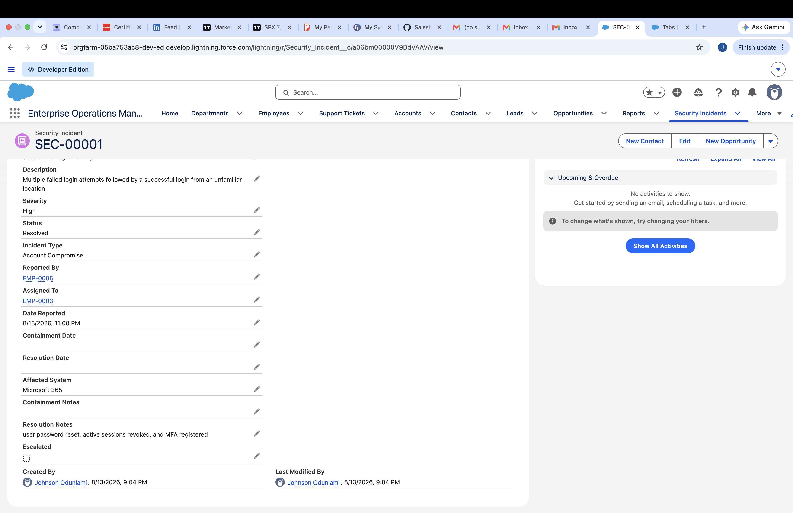

# Security Incident Management — Salesforce Portfolio Module

## Overview

The Security Incident Management module was built in Salesforce Lightning to track cybersecurity incidents from initial reporting through investigation, containment, resolution, and escalation.

## Business Requirements

The solution needed to:

- Capture cybersecurity incidents in a centralized system.
- Track incident severity, type, status, affected system, reporter, and assignee.
- Prevent incidents from being resolved without resolution documentation.
- Automatically escalate unresolved High and Critical severity incidents.
- Provide reporting and dashboard visibility into security operations.

## Salesforce Object

### Security Incident

Key fields include:

- Incident Number
- Incident Title
- Description
- Severity
- Status
- Incident Type
- Reported By
- Assigned To
- Date Reported
- Containment Date
- Resolution Date
- Affected System
- Containment Notes
- Resolution Notes
- Escalated

## Validation Rule

A validation rule prevents a Security Incident from being marked Resolved or Closed unless Resolution Notes are provided.

## Automation

### High-Risk Incident Escalation Flow

A record-triggered Flow evaluates newly created or updated Security Incident records.

Incidents are automatically escalated when:

- Severity is High or Critical
- Status is not Resolved
- Status is not Closed
- Escalated is currently False

The Flow sets:

- Escalated = True

## Testing

The automation was tested using:

### High Severity Test
A phishing incident affecting Microsoft 365 was created with:

- Severity: High
- Status: New
- Escalated initially unchecked

The Flow automatically set Escalated to True.

### Medium Severity Test
A suspicious USB device incident was created with:

- Severity: Medium
- Status: New
- Escalated unchecked

The incident remained un-escalated, confirming the Flow correctly excludes Medium severity incidents.

## Reports

Created reports include:

- Security Incidents by Severity
- Security Incidents by Status
- Escalated Security Incidents
- Security Incidents by Assignee

## Dashboard

The Security Operations Dashboard provides:

- Incident distribution by severity
- Incident distribution by status
- Escalated incident count
- Incident workload by assignee

## Skills Demonstrated

- Salesforce Lightning
- Custom Objects
- Lookup Relationships
- Picklist Configuration
- Validation Rules
- Record-Triggered Flows
- Decision Logic
- Assignment Elements
- Before-Save Automation
- Custom Report Types
- Reports
- Dashboards
- Security ## Screenshots

### Validation Rule Error

### Security Incident Record

### High-Risk Escalation Flow

### High-Risk Escalation Test

### Security Operations Dashboard
 Workflow Design
